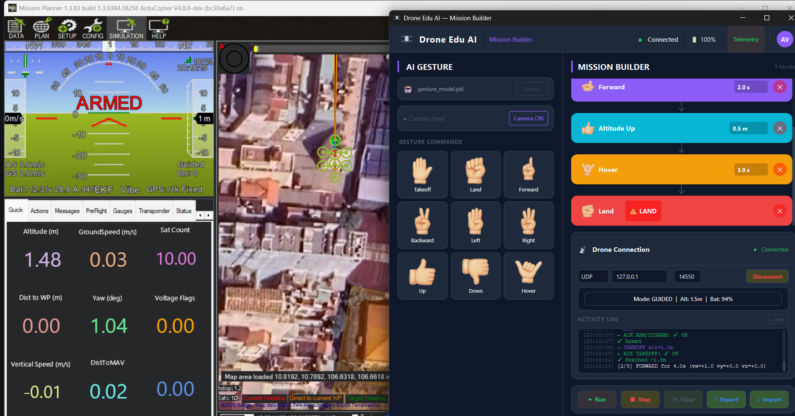

# AI Drone Edu v2

Nền tảng điều khiển và mô phỏng Drone thông minh dành cho giáo dục (STEAM) tích hợp Trí tuệ nhân tạo (AI), giao diện lập trình trực quan (Mission Builder) và giao thức điều khiển MAVLink.

## 📁 Cấu trúc thư mục

Dự án được chia thành nhiều ứng dụng và module con, mỗi phần đảm nhiệm một vai trò riêng biệt trong quy trình từ huấn luyện AI đến điều khiển Drone thực tế.

- **`DroneEduAI/`**: Ứng dụng trung tâm (Core Application). Đây là giao diện điều khiển chính dành cho người dùng cuối, tích hợp Mission Builder và hệ thống điều khiển bay.
- **`AIGestureModelTrainer/`**: Ứng dụng/Script dùng để huấn luyện mô hình Machine Learning (Logistic Regression) từ dữ liệu đã thu thập.
- **`GestureDatasetCollectorApp/`**: Ứng dụng hỗ trợ thu thập dữ liệu khung xương tay (Hand Landmarks) qua camera để xây dựng tập dữ liệu (dataset) huấn luyện AI.
- **`GestureTesterApp/`**: Ứng dụng dùng để kiểm tra và đánh giá độ chính xác của mô hình nhận diện cử chỉ (sau khi train) theo thời gian thực.
- **`dataset/`**: Thư mục chứa các tệp dữ liệu huấn luyện (CSV) được sinh ra từ quá trình thu thập.
- **`models/`**: Thư mục lưu trữ các mô hình AI (như file `.pkl` của scikit-learn, hay `.task` của MediaPipe).
- **`icons/` & `picture/`**: Lưu trữ các tài nguyên hình ảnh, biểu tượng giao diện (UI Assets) dùng cho các ứng dụng.

---

## 🚁 Về Ứng dụng `DroneEduAI` (Main Application)

**DroneEduAI** là ứng dụng chính của dự án, được phát triển dưới dạng Desktop App sử dụng nền tảng **PySide6 (Qt Framework)** với giao diện Dark Theme hiện đại.

### Các tính năng chính:

1. **AI Gesture Control (Điều khiển bằng cử chỉ)**
   - Sử dụng **MediaPipe Hands** để lấy tọa độ khung xương tay (Landmarks) với tốc độ cao.
   - Phân loại cử chỉ theo thời gian thực bằng thuật toán học máy **Logistic Regression (scikit-learn)**.
   - Hệ thống có cơ chế kiểm tra chất lượng (Quality Check), yêu cầu giữ cử chỉ trong 2 giây để tránh nhiễu trước khi sinh ra khối lệnh tương ứng.

2. **Native Drag-and-Drop Mission Builder (Giao diện lập trình kéo thả)**
   - Xây dựng hoàn toàn bằng **PySide6** với khả năng kéo-thả (Drag & Drop) mượt mà.
   - Người dùng có thể kéo thả các thẻ lệnh (Block Cards) như: Takeoff, Land, Forward, Hover...
   - Tùy chỉnh thông số cho từng khối lệnh (độ cao, thời gian bay, khoảng cách).
   - Hỗ trợ lưu và tải các kịch bản bay (Mission) dưới dạng JSON.

3. **Điều khiển & Giám sát Drone (MAVLink/ArduPilot)**
   - Giao tiếp trực tiếp với Flight Controller (chạy ArduPilot) thông qua giao thức **PyMAVLink**.
   - Cung cấp trạng thái thời gian thực (Telemetry) bao gồm pin, chế độ bay, và chất lượng tín hiệu.
   - Hỗ trợ kiểm thử kịch bản thông qua môi trường mô phỏng (SITL) trước khi triển khai bay thực tế.

## 🛠 Yêu cầu hệ thống
- Python 3.9+
- Các thư viện yêu cầu: `PySide6`, `mediapipe`, `opencv-python`, `scikit-learn`, `pymavlink` (có thể cài đặt qua file `requirements.txt`).
